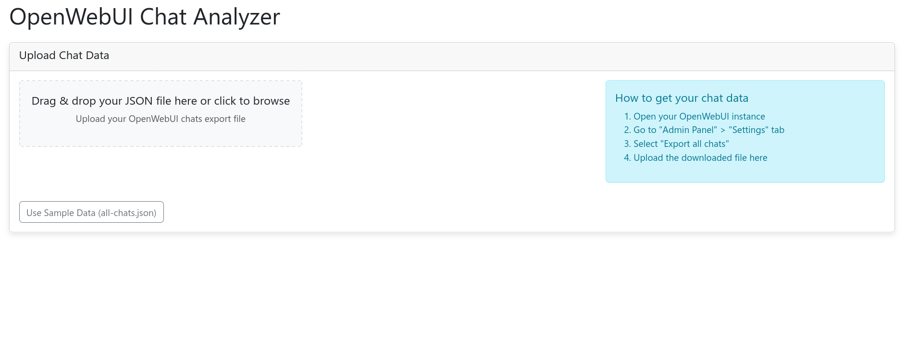
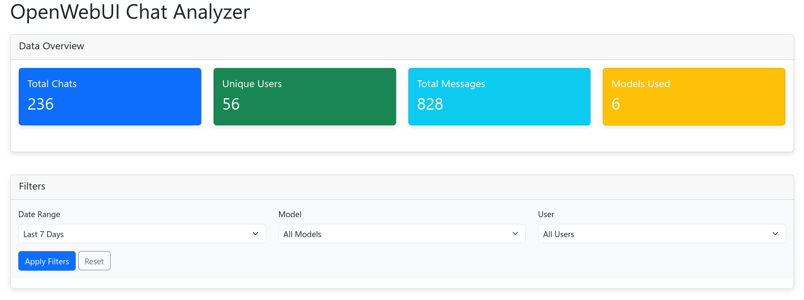
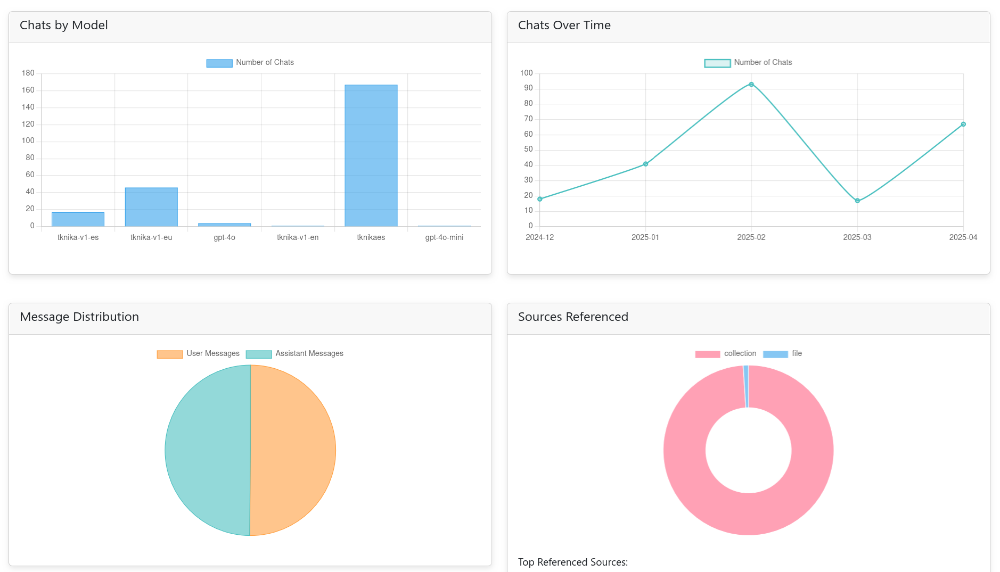
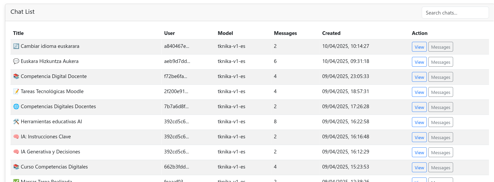

# OpenWebUI Chats Analyzer

## Overview

This is a simple tool to analyze chats from OpenWebUI. It provides a user-friendly interface to visualize and understand chat data.

## Getting Started

There are two ways to use this tool:

1. **Upload your own chat data**: Simply drag and drop your JSON file onto the upload area
2. **Use the default sample file**: Click the "Use Sample Data" button to analyze the included all-chats.json file

## Downloading chats from OpenWebUI

1. Open your OpenWebUI instance.
2. Go to "Admin Panel" > "Settings" tab.
3. Select the option "Export all chats".

This will download a file named `all-chats-export-<id>.json` to your computer.

## Features

- Interactive charts showing model usage, chat timeline, and message distribution
- Ability to filter chats by date, model, and user
- Detailed message view with source references when available
- Search functionality to find specific chats
- File upload to analyze your own JSON data

## Screenshots










## JSON File Structure

Each chat in the OpenWebUI export JSON file follows this structure:

```json
{
  "id": "unique-chat-id",
  "user_id": "user-identifier",
  "title": "Chat title",
  "chat": {
    "id": "",
    "title": "Chat title",
    "models": ["model-name"],
    "params": {},
    "history": {
      "messages": {
        "message-id": {
          "id": "message-id",
          "parentId": null or "parent-message-id",
          "childrenIds": ["child-message-ids"],
          "role": "user" or "assistant",
          "content": "Message text content",
          "timestamp": unix-timestamp,
          "models": ["model-name"]
        },
        // Additional messages...
      },
      "currentId": "current-message-id"
    },
    "messages": [
      {
        "id": "message-id",
        "parentId": null or "parent-message-id",
        "childrenIds": ["child-message-ids"],
        "role": "user" or "assistant",
        "content": "Message text content",
        "timestamp": unix-timestamp,
        "models": ["model-name"]
      },
      // Assistant response
      {
        "id": "message-id",
        "parentId": "parent-message-id",
        "childrenIds": [],
        "role": "assistant",
        "content": "Response text content",
        "model": "model-name",
        "modelName": "model-name",
        "modelIdx": 0,
        "userContext": null,
        "timestamp": unix-timestamp,
        "statusHistory": [],
        "sources": [
          // Reference sources if any
          {
            "source": {
              "id": "source-id",
              "user_id": "user-id",
              "name": "Source name",
              "description": "Source description",
              // Additional metadata...
            },
            "document": [
              // Text fragments from source documents
            ],
            "metadata": [
              // Metadata about source documents
            ]
          }
        ],
        "done": true
      }
    ],
    "tags": [],
    "timestamp": unix-timestamp,
    "files": []
  },
  "updated_at": unix-timestamp,
  "created_at": unix-timestamp,
  "share_id": null,
  "archived": false,
  "pinned": false,
  "meta": {
    "tags": ["tag-values"]
  },
  "folder_id": null
}
```

Key elements in each chat:
- Basic metadata: `id`, `user_id`, `title`, timestamps
- Messages: Array of user and assistant messages with their content
- Message relationships: Parent-child relationships between messages
- Sources: Referenced documents or knowledge sources (when available)
- Model information: Which AI models were used in the conversation
- Status information: Creation time, update time, tags, etc.

## Screenshots

